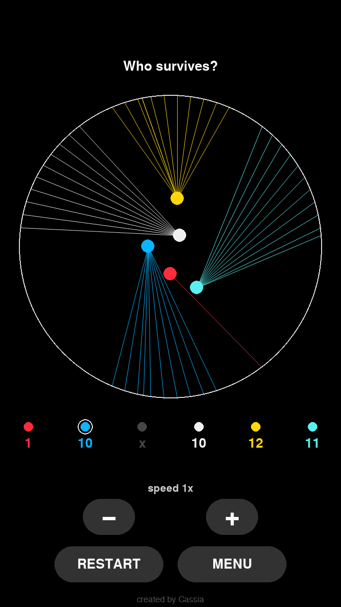

# Who survives?

Colored balls tied to the edge by lines battle inside a circular arena. Touch a line of another color and you cut it. The last ball with lines left wins.

### ▶ [Play now](https://CassiaCristina0o.github.io/color-battle/)

Runs right in your phone or computer browser, with nothing to install. The first time, it may take up to 1 minute to load.

## Features

- **Bet on the champion:** pick the color you think will win and see if you were right at the end.
- **2 to 10 balls per match**, with colors drawn at random each round.
- **A tense finish:** the arena shrinks, slow motion kicks in for the final duel, and a ball that is almost out of lines can still turn the game around.
- **Adjustable speed** during the match, from 0.25x to 3x.
- **English and Portuguese:** opens in your device's language, and you can switch in the menu.
- **Made for mobile:** everything works with taps.

## How to play

1. Choose how many balls will play.
2. Tap the color you think will win (optional).
3. Tap **PLAY** and watch the match.

---

Technical details (architecture, physics, web version and settings): [TECHNICAL.md](TECHNICAL.md)
